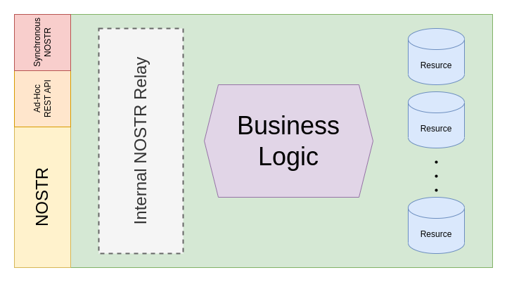

# Internal Module (Generic) Architecture

An Internal Module's generic architecture looks like this:

Its constituent parts are:

- **NOSTR _(optional)_ :** the main asynchronous NOSTR interface via which to publish and subscribe to the main NOSTR backbone.
- **Synchronous Nostr _(optional)_ :** a synchronous REST API that accepts a NOSTR event and synchronously acts upon it.
- **Ad-Hoc REST API _(optional)_ :** a set of _ad-hoc_ REST API endpoints to support non-NOSTR-based flows.
- **Internal NOSTR Relay _(optional)_ :** an optional part of the Internal Module's architecture, its purpose is to act as a sort of "local read-only replica", so as to reduce the pressure on the main Local NOSTR Relay whilst at the same time providing all the required `REQ` subscriptions to the module's Business Logic.
- **Resources _(optional)_ :** an Internal Module is free to declare and use as many resources as it sees fit, they're their sole responsibility and the System Architecture at large knows not about them.
- **Business Logic:** the Internal Module's business logic component realizes the module's purpose (it may contain an internal router, expose different sets of ports for different APIs, whatever the Internal Module's writer desires, so long as the API Gateway knows how to interact with it).

**ALL** Internal Modules are required to answer to (at least) one NOSTR Public Key.
Furthermore, the API Gateway needs to know how to route HTTP requests to the appropriate internal module.

In what follows, we'll assume that _all_ Internal Modules implicitly know the public keys every other internal module responds to; furthermore, we'll assume _all_ internal modules implicitly know how to route HTTP requests to the appropriate internal modules.
