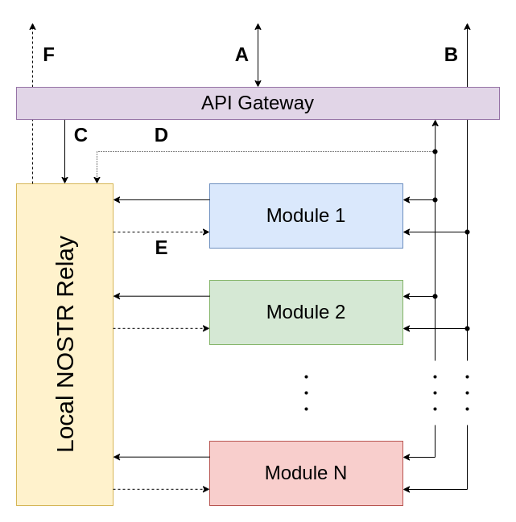

# System Architecture

Graphically, the System Architecture looks like this:

The internal components are:

- **API Gateway:** this is the main generic interface with the outside world.
    The API Gateway is in charge of basic authentication, rate limiting, pacing, etc., and it's also the one responsible for routing the given REST request to the module handling it (or to the Local NOSTR Relay, if applicable).
- **Local NOSTR Relay:** this is the backbone of the internal communication framework, **EVERY STATE-CHANGING MESSAGE SHOULD BE RUN THROUGH THE LOCAL NOSTR RELAY**, this is so that messages in the relay may be published to a _public_ relay for auditing.
- **Internal Modules:** these are the interconnected pieces doing the actual work.
    Examples of actual internal modules are: Ledger Module, EVM-Gateway Module, NFC Card Module, etc.

The arrows represent different API accesses to the Wallet Provider System.
These can be categorized thusly:

- **HTTP APIs:** these are accessed via HTTP, and can be further categorized into:
  - **Ad-Hoc APIs:** an HTTP API hosted and routed directly towards an Internal Module, not necessarily REST-full itself; these APIs are provided for in order to allow for pre-existing use-case-specific behavior.
  - **Generic REST APIs:** a REST API aimed at talking to the system as a whole, used mainly for configuration and API management itself.
- **NOSTR APIs:** these are the main backbone of the Wallet Provider proper; they can be divided into "external" or "internal" ones:
  - **External:** these APIs are not _restricted_ to being externally called (ie. they _can_ be used by Internal Modules to communicate with each other), but _are_ exposed to the outside world nonetheless.
      The entities being transferred back and forth in these APIs are NOSTR events proper; sometimes this will be via a NOSTR-specific mechanism, sometimes it will be via HTTP, and this depends on the access pattern expected of it:
    - **Synchronous Write API:** this is REST API implementing a _synchronous_ NOSTR API provided for low-latency scenarios.
        This API will accept a `PUT` method with a NOSTR event as body, and (based off of the first `p` tag) route it to the corresponding Internal Module, waiting for a response, and sending it back to the client.
    - **Asynchronous Write API:** this is a REST API implementing an _asynchronous_ NOSTR API provided for general use.
        This API will accept a `PUT` method with a NOSTR event as body, and publish it to the Local NOSTR Relay, returning a `200` response to the client.
    - **Asynchronous Read API:** this is simply a WebSocket connection to the Local NOSTR Relay, issued one or more `REQ` NOSTR commands.
  - **Internal:** these APIs are realized via the Local NOSTR Relay proper, and consist more of a set of "protocols" than an API like the ones we're used to.
    - **Asynchronous Read/Write API:** a normal `PUB` / `REQ` pair will serve as the "upstream" (ie. `PUB`) and "downstream" (ie. `REQ`) halves of the communication channel.

The API Gateway component itself provides the implementation for:

- **NOSTR Synchronous Write API:** via a `dispatch` endpoint, where a `PUT` method with a NOSTR event as body will be accepted, examined, and (based off of the first `p` tag therein) routed to the corresponding Internal Module, upon receiving a response it is forwarded to the requesting client as-is.
- **NOSTR Asynchronous Write API:** via a `publish` endpoint, where a `PUT` method with a NOSTR event as body will be accepted, examined, and `PUB`'d to the Local NOSTR Relay.
