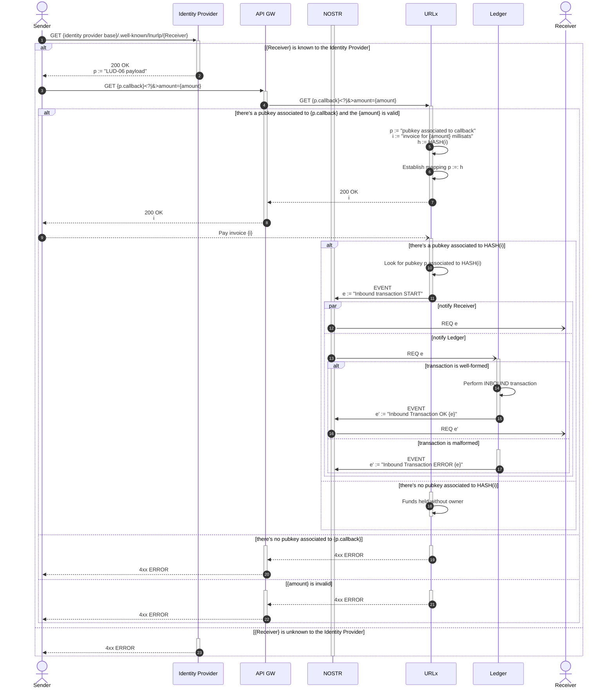

# Deposit via LN

A _Deposit via Lightning Network_ is an INBOUND transaction initiated by the Sender that will increase the wallet provider's SATs balance for the Receiver.
From a practical perspective, this entails querying the Identity Provider for the Receiver's [LUD-16: Paying to static internet identifiers](https://github.com/lnurl/luds/blob/luds/16.md) payload, and using it to generate a invoice, paying it, and having the URLx module pick it up and perform an INBOUND transaction on the Ledger module.

## Sequence



This proceeds as follows:

1. A `GET {identity provider base}/.well-known/lnurlp/{Receiver}` is performed to retrieve the [LUD-16: Paying to static internet identifiers](https://github.com/lnurl/luds/blob/luds/16.md) payload.
2. The Identity Provider responds with a [LUD-16: Paying to static internet identifiers](https://github.com/lnurl/luds/blob/luds/16.md) payload.
3. A `GET {p.callback}<?|&>amount={amount}` is performed, asking for an invoice for the given amount (in millisats).
4. The call is forwarded to the URLx module.
5. The pubkey (belonging to a Ledger account) associated to the callback being served is extracted, an invoice created, and the invoice's hash calculated.
6. A mapping between the hash and the pubkey is established.
7. The created invoice is returned.
8. The created invoice is forwarded.
9. The Sender eventually pays the invoice and the URLx module (via an internal LND daemon) notices this.
10. The pubkey associated to the paid invoice's hash is retrieved.
11. An Inbound Transaction START event is published to the NOSTR relay.
12. The Receiver is eventually notified (a subscribed application may then show that an inbound transaction is in progress).
13. The Ledger is eventually notified, triggering the transaction processing.
14. The inbound transaction is performed.
15. The Ledger publishes an Inbound Transaction OK event to the NOSTR relay.
16. The Receiver es eventually notified of the transaction's result.
17. If the inbound transaction itself was malformed, the Ledger publishes an Inbound Transaction ERROR event to the NOSTR relay.
18. If the paid invoice had no pubkey associated to its hash, the funds are held, but not attributed to any particular account.
19. If there was no pubkey associated to the callback, respond with a `4xx ERROR` HTTP status code.
20. Said status code is forwarded to the Sender.
21. If the amount given was invalid, respond with a `4xx ERROR` HTTP status code.
22. Said status code is forwarded to the Sender.
23. Finally, if the Identity Provider has no knowledge of the given Receiver, simply respond with a `4xx ERROR` HTTP status code.

## NOSTR Events

The NOSTR events involved in a Deposit via LN all follow the general NOSTR event anatomy outlined above.

### Inbound Transaction START

This event is produced by the URLx module and contains information about how many tokens to create in the Receiver's account.

The `TARGET` **MUST** be the Ledger module's public key.
An additional `"p"` tag **MUST** mention the Receiver's public key.
**EXACTLY** two `"p"` tags must be present (the first one indicating the `TARGET`, the second one indicating the Receiver).

The `{event sub-kind}` **MUST** be `"inbound-transaction-start"`.

The `.content` field must conform to:

```json showLineNumbers copy
{
    "tokens": {
        "{tokenId}": {amount}
    },
    "memo": "{invoice}"
}
```

Only a single `{tokenId}` can be present (ie. that representing the SATs "token").
The `{amount}` value **MUST** be _positive_ (ie. non 0, non negative), and correspond with the invoice's amount.

The `.memo` field is **REQUIRED**, and **MUST** contain the invoice that generated this token creation.

### Inbound Transaction OK

This event is produced by the Ledger module, to indicate that an inbound transaction has been appropriately processed.

The `TARGET` **MUST** be the `AUTHOR` associated to the Inbound Transaction START event having triggered the transaction proper.
An additional `"p"` tag **MUST** mention the Receiver's public key.
An `"e"` tag **MUST** be included mentioning the Inbound Transaction START EVENT's `.id`.

The `{event sub-kind}` **MUST** be `"inbound-transaction-ok"`.

The `.content` field must be simply `{}`.

### Inbound Transaction ERROR

This event is produced by the Ledger module, to indicate that an inbound transaction has _failed_ to be appropriately processed.

The `TARGET` **MUST** be the `AUTHOR` associated to the Inbound Transaction START event having triggered the transaction proper.
An additional `"p"` tag **MUST** mention the Receiver's public key.
An `"e"` tag **MUST** be included mentioning the Inbound Transaction START EVENT's `.id`.

The `{event sub-kind}` **MUST** be `"inbound-transaction-error"`.

The `.content` field must conform to:

```json showLineNumbers copy
{
    "messages": [
        "{error message}",
        {additional error messages}
    ]
}
```
