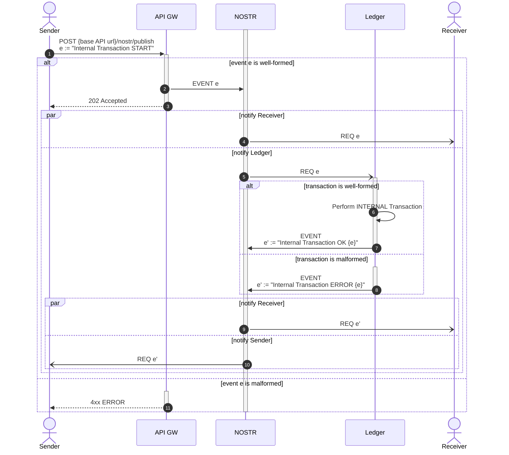

# Internal Transaction

An _Internal Transaction_ is a transaction between two pre-existing members of the same federation.
From a practical perspective, it merely entails letting the Ledger module know about this and having it move the funds around without incurring any "on-chain" costs.

## Sequence



This proceeds as follows:

1. A `POST {base API url}/nostr/publish` is performed with an Internal Transaction START event as body.
2. If the event is well-formed, it is then published to the NOSTR relay.
3. The API Gateway responds with a `202 Accepted` HTTP status code.
4. The Receiver is eventually notified (a subscribed application may then show that an internal transaction is in progress).
5. The Ledger is eventually notified, triggering the transaction processing.
6. Assuming the transaction itself is well-formed, the transaction proper takes place.
7. The Ledger publishes an Internal Transaction OK event to the NOSTR relay.
8. If the transaction itself was malformed, the Ledger publishes an Internal Transaction ERROR event to the NOSTR relay.
9. The Receiver es eventually notified of the transaction's result.
10. The Sender is eventually notified of the transaction's result.
11. If the original event was malformed, respond with a `4xx ERROR` HTTP status code.

## NOSTR Events

The NOSTR events involved in an Internal Transaction all follow the general NOSTR event anatomy outlined above.

### Internal Transaction START

This event is produced by the Sender and contains information about how many tokens to transfer to the Receiver's account.

The `TARGET` **MUST** be the Ledger module's public key.
An additional `"p"` tag **MUST** mention the Receiver's public key.
**EXACTLY** two `"p"` tags must be present (the first one indicating the `TARGET`, the second one indicating the Receiver).

The `{event sub-kind}` **MUST** be `"internal-transaction-start"`.

The `.content` field must conform to:

```json showLineNumbers copy
{
    "tokens": {
        "{tokenId}": {amount},
        {additional tokenId / amount pairs}
    },
    "memo": "{memo string}"
}
```

All of the `{amount}` values within the `.tokens` dictionary **MUST** be _positive_ (ie. non 0, non negative).

The `.memo` field is **OPTIONAL**.

### Internal Transaction OK

This event is produced by the Ledger module, to indicate that an internal transaction has been appropriately processed.

The `TARGET` **MUST** be the `AUTHOR` associated to the Internal Transaction START event having triggered the transaction proper.
An additional `"p"` tag **MUST** mention the Receiver's public key.
An `"e"` tag **MUST** be included mentioning the Internal Transaction START EVENT's `.id`.

The `{event sub-kind}` **MUST** be `"internal-transaction-ok"`.

The `.content` field must be simply `{}`.

### Internal Transaction ERROR

This event is produced by the Ledger module, to indicate that an internal transaction has _failed_ to be appropriately processed.

The `TARGET` **MUST** be the `AUTHOR` associated to the Internal Transaction START event having triggered the transaction proper.
An additional `"p"` tag **MUST** mention the Receiver's public key.
An `"e"` tag **MUST** be included mentioning the Internal Transaction START EVENT's `.id`.

The `{event sub-kind}` **MUST** be `"internal-transaction-error"`.

The `.content` field must conform to:

```json showLineNumbers copy
{
    "messages": [
        "{error message}",
        {additional error messages}
    ]
}
```
