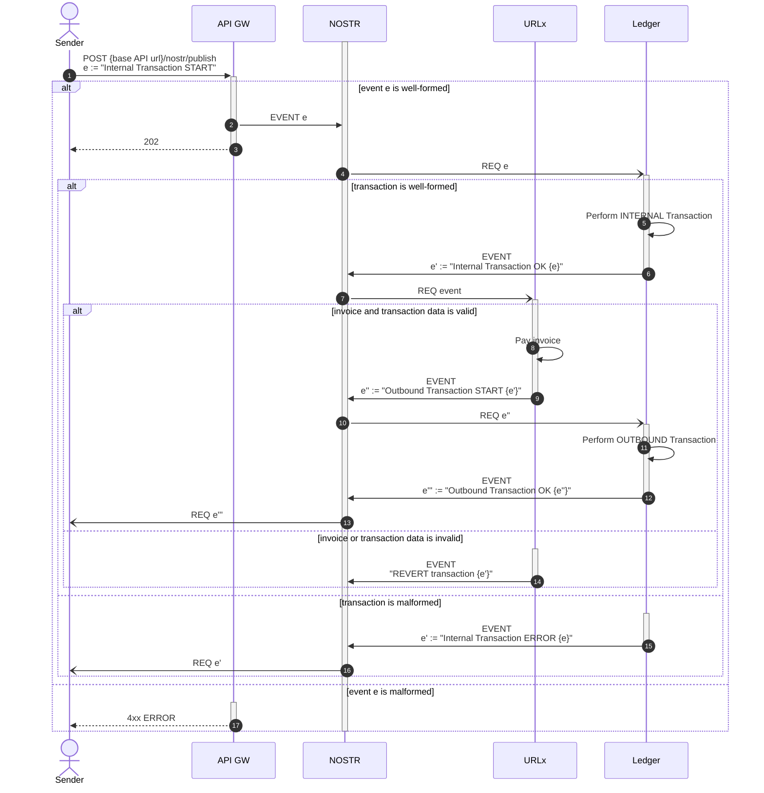

# Withdraw via LN

A _Withdraw via LN_ is an OUTBOUND transaction initiated by the Sender that will decrease the wallet provider's SATs balance for the Sender.
From a practical perspective, this simply entails paying a LN invoice.

Note that this same flow is applicable to paying [NIP-57: Lightning Zaps](https://github.com/nostr-protocol/nips/blob/master/57.md) since, at its core, it's nothing more than a LN invoice payment itself.

The main idea is to have the Sender send funds to a _LN Gateway_, ie. a Ledger account belonging to the URLx module that acts as a "staging area" for outbound funds.
The transaction proper needs to include the invoice to pay.
The URLx module will detect this, and try to pay said invoice with the funds transferred, and if successful, will perform the OUTBOUND transaction in the Ledger module.

## Sequence



This proceeds as follows:

1. A `POST {base API url}/nostr/publish` is performed with an Internal Transaction START event as body.
  This should be directed towards the LN Gateway (ie. the event's `TARGET` should be the URLx Module's pubkey), and should include the invoice to pay as `memo`.
2. If the event is well-formed, it is then published to the NOSTR relay.
3. The API Gateway responds with a `202 Accepted` HTTP status code.
4. The Ledger is eventually notified, triggering the transaction processing.
5. Assuming the transaction itself is well-formed, the INTERNAL transaction proper takes place.
6. The Ledger publishes an Internal Transaction OK event to the NOSTR relay.
7. The URLx module is eventually notified of the transaction's result.
8. Assuming the invoice included in the transaction is well-formed and the funds transferred equal the invoice's amount, the invoice is paid via LN.
9. The URLx module publishes an Outbound Transaction START event.
10. The Ledger is eventually notified, triggering the transaction processing.
11. Assuming the transaction itself is well-formed, the OUTBOUND transaction proper takes place.
12. The Ledger publishes an Outbound Transaction OK event to the NOSTR relay.
13. The Sender is eventually notified of the transaction's result.
14. If the invoice or transaction were malformed, a "REVERT transaction" event is published to the NOSTR relay.
15. If the INTERNAL transaction itself was malformed, the Ledger publishes an Internal Transaction ERROR event to the NOSTR relay.
16. The Sender is eventually notified of the transaction's result.
17. If the original event was malformed, respond with a `4xx ERROR` HTTP status code.

## NOSTR Events

The NOSTR events involved in a Withdraw via LN all follow the general NOSTR event anatomy outlined above.

### Internal Transaction START

This event is produced by the Sender and contains information about how many sats to transfer and the LN invoice to pay.

The `TARGET` **MUST** be the Ledger module's public key.
An additional `"p"` tag **MUST** mention the URLx module's public key.
**EXACTLY** two `"p"` tags must be present (the first one indicating the `TARGET`, the second one indicating the URLx module's public key).

The `{event sub-kind}` **MUST** be `"internal-transaction-start"`.

The `.content` field must conform to:

```json showLineNumbers copy
{
    "tokens": {
        "{satsTokenId}": {amount}
    },
    "memo": "{LN invoice to pay}"
}
```

The `{amount}` value within the `.tokens` dictionary **MUST** be _positive_ (ie. non 0, non negative).

The `.memo` field is **REQUIRED**, and **MUST** contain a valid LN Invoice for the same number of sats as specified in the `.tokens` dictionary.

### Internal Transaction OK

This event is produced by the Ledger module, to indicate that an internal transaction has been appropriately processed.

The `TARGET` **MUST** be the `AUTHOR` associated to the Internal Transaction START event having triggered the transaction proper.
An additional `"p"` tag **MUST** mention the URLx module's public key.
An `"e"` tag **MUST** be included mentioning the Internal Transaction START EVENT's `.id`.

The `{event sub-kind}` **MUST** be `"internal-transaction-ok"`.

The `.content` field must be simply `{}`.

### Internal Transaction ERROR

This event is produced by the Ledger module, to indicate that an internal transaction has _failed_ to be appropriately processed.

The `TARGET` **MUST** be the `AUTHOR` associated to the Internal Transaction START event having triggered the transaction proper.
An additional `"p"` tag **MUST** mention the URLx module's public key.
An `"e"` tag **MUST** be included mentioning the Internal Transaction START EVENT's `.id`.

The `{event sub-kind}` **MUST** be `"internal-transaction-error"`.

The `.content` field must conform to:

```json showLineNumbers copy
{
    "messages": [
        "{error message}",
        {additional error messages}
    ]
}
```
